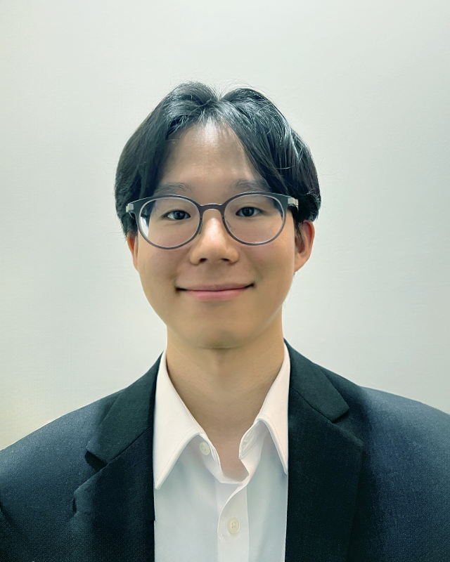

# Seonghwan Lim

**Master of Science in Computer Science** – Illinois Institute of Technology  
- **Email:** [slim24@hawk.iit.edu](mailto:slim24@hawk.iit.edu)  
- **LinkedIn:** [slim-97-kr](https://www.linkedin.com/in/slim-97-kr)  
- **GitHub:** [seonghwan97](https://github.com/seonghwan97)

## About Me

  

**Hi everyone!** I’m a master’s student in Computer Science with a **deep passion for computer vision and machine learning**. I love designing and fine-tuning neural network architectures, implementing advanced algorithms, and applying feature extraction techniques to solve practical challenges. My core interest is leveraging computer vision across diverse fields—logistics, bioengineering, human performance analysis, or aviation—to create high-impact solutions that genuinely make a difference.

In the logistics sector, I created an **object detection** program that leverages complex neural network architectures to precisely identify which items are being stored, enabling more efficient inventory management. In one bioengineering lab, I focus on **real-time microfluid mixing detection** and control to ensure optimal flow conditions. Meanwhile, in the other group, I’m a research co-pilot exploring **CT and MRI imaging for organ segmentation**.

My interests also extend to analyzing **3D human pose** data to evaluate performance and energy usage—insights that could transform how we train athletes, improve workplace ergonomics, and more. Additionally, I’m engaged in a **drone-based 3D scanning** project for aircraft structural inspections, where automated and accurate defect detection can save time, cost, and potentially lives.

## Projects

### Drone Mounted with 3D Surface Scanner for Aircraft Structural Inspections
**Duration:** Feb 2025 – Present  
- Integrated five camera feeds using Python-based algorithms and MediaPipe’s Pose Landmark detection to achieve robust 3D pose estimation, leveraging comprehensive data analysis and literature reviews for improved accuracy in mixed reality environments.  
- Leveraging FAA regulations and airline maintenance manuals for comprehensive solutions, including 3D CAD modeling, safety risk analysis, and cost-benefit evaluation.  

### Human Activity Inference in Mixed Reality
**Duration:** Jan 2025 – Present  
- Integrated five camera feeds using Python-based algorithms and MediaPipe’s Pose Landmark detection to achieve robust 3D pose estimation, leveraging comprehensive data analysis and literature reviews for improved accuracy in mixed reality environments.  
- Collaborated in weekly Friday lab meetings with four team members and three professors, refining solutions by combining 3D pose data with EEG, heart rate, and motion signals to enhance energy and performance predictions, ultimately creating more immersive user experiences.  

### Dynamic MRI and CT Segmentation
**Duration:** Jan 2025 – Present
- Currently exploring a research project integrating MRI and CT segmentation data to enhance organ imaging accuracy and support dynamic analysis.  
- Leveraged ITK-SNAP for medical image visualization and annotation, enabling detailed volumetric assessments, improved workflow efficiencies, and streamlined data manipulation.  
- Present progress weekly in lab meetings alongside one professor, five senior researchers, and four co-pilots. These sessions focus on refining segmentation techniques, discussing challenges, and optimizing methodologies to achieve high-quality medical imaging outcomes.  

### Microfluid Control System
**Duration:** Jan 2025 – Present
- Analyzing real-time microfluidic videos to assess mixing efficiency, enabling precise droplet control for improved flow conditions.  
- Generating microfluid simulations in MATLAB to model different flow scenarios, refine droplet behavior, and optimize mixing strategies.  
- Presenting progress every two weeks to a supervising professor, discussing ongoing results, potential challenges, and future research directions.  

### NICE with Knowledge Distillation
**Duration:** Oct – Nov 2024  
**Repo:** [GitHub](https://github.com/seonghwan97/NICE-with-KD.git)  
- Enhanced class-incremental learning by integrating Knowledge Distillation (KD), boosting accuracy from 39% to 49% on CIFAR-10 and from 44% to 59% on MNIST.  
- Mitigated catastrophic forgetting through teacher-student learning approaches and dynamic neuron management strategies.

### Data Structures Performance Analysis
**Duration:** Oct – Nov 2024  
**Repo:** [GitHub](https://github.com/seonghwan97/Data-Structure-Performance-Analysis.git)  
- Implemented and analyzed key data structures (arrays, linked lists, binary search trees).  
- Developed a GUI to visualize performance, showcasing algorithm optimization in Java for efficient employee data management.

### Object Detection Tasks in the Logistics Field
**Duration:** May – Sep 2023  
- Applied project and team management principles to lead four members, establish strategic milestones, and foster a collaborative environment.  
- Optimized the DINO transformer and YOLOv5 model for object detection across diverse domains, achieving a 7.5% higher accuracy than the baseline.

### Development of Marionette Motion Control System
**Duration:** Jan – Dec 2022  
- Designed a real-time puppet motion system using Kinect v1 for motion tracking.  
- Integrated motor control to precisely replicate human-to-puppet movements with gesture recognition.

## Experiences

### Teaching Assistance: CS401 Introduction to Advanced Studies I
**Location:** Illinois Institute of Technology  
**Duration:** Jan 2025 – Present  
- Delivered comprehensive lab-based instruction on data structures and Java programming.  
- Oversaw assignment grading and exam proctoring, providing targeted, constructive feedback to drive student improvement.

### Teaching Assistance: CS402 Introduction to Advanced Studies II
**Location:** Illinois Institute of Technology  
**Duration:** Jan 2025 – Present  
- Delivered comprehensive lab-based instruction on computer architecture and C/C++ software development.  
- Oversaw assignment grading and exam proctoring, offering detailed feedback to facilitate student growth.

### Teaching Assistance: Software Programming
**Location:** Seoul National University of Science and Technology  
**Duration:** Mar – Jun 2023  
- Graded assignments and supervised exams for the Software Programming course, upholding academic standards and integrity.  
- Addressed student inquiries about C/C++ with in-depth guidance, fostering a supportive and engaging learning environment.

### Research Assistance
**Location:** Seoul National University of Science and Technology  
**Duration:** Jan – Dec 2023  
- Collaborated with a faculty member and two researchers to develop object detection and incremental learning tasks, leveraging architectures such as ResNet, YOLO, and ViT.  
- Communicated technical findings effectively with peers and advisors, contributing to technical reports and documentation.

## Skills
- **Programming Languages:** Python, Java, C/C++, SQL  
- **Frameworks & Tools:** PyTorch, TensorFlow, OpenCV, Scikit-Learn, Keras  
- **Technologies:** Machine Learning, Knowledge Distillation, Computer Vision, Data Analysis  
- **Other:** Linux (Ubuntu), Git, MS Office

## Honors
- **Illinois Institute of Technology Graduate Pathways Scholarship** | Apr 2024  
- **First Prize at 2023 CJ Logistics Future Technology Challenge** | Sep 2023  
